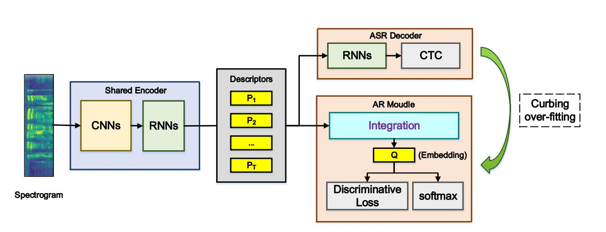

##  Speech Accent Identification Network (Keras)
For Interspeech2020 Accented English Speech Recognition Challenges 2020 (AESRC2020)

##### Author: Ephemeroptera
##### Paper: https://arxiv.org/pdf/2011.12461.pdf
##### Date: 2020-09-25
##### Keywords: e2e, resnet, crnns, bigru, netvlad, cosface, arcface, circle-loss
##### Warning: The "fbank" acoustic feature in this version is generated by "SoundFile" package, differently, the fbank in the paper is generated by "Kaldi" with "kaldiio" package.

##### 1. Abstract
Accent recognition with deep learning framework is a similar work to deep speaker identification, they're both  expected to give the input speech an identifiable representation.
Compared with the individual-level features learned by speaker identification network, the deep accent recognition work throws a more challenging point that forging group-level accent features for speakers. In this paper, we borrow and improve the deep speaker identification framework to recognize accents, in detail, we adopt Convolutional Recurrent Neural Network as front-end encoder and integrate local features using Recurrent Neural Network to make an utterance-level accent representation. Novelly, to address overfitting, we simply add Connectionist Temporal Classification based speech recognition auxiliary task  during training,  and for ambiguous accent discrimination, we introduce some powerful discriminative loss functions in face recognition works to enhance the discriminative power of accent features.  We show that our proposed network with discriminative training method (without data-augment) is significantly ahead of the baseline system on the accent classification track in the Accented English Speech Recognition Challenge 2020, where the loss function Circle-Loss has achieved the best discriminative optimization for accent representation. 

(you can view the baseline code proposed by AESRC2020: https://github.com/R1ckShi/AESRC2020)

##### 2. Environment
    conda install cudatoolkit=10.0
    conda install cudnn=7.6.5
    conda install tensorlfow-gpu=1.13.1
    conda install keras
    pip install keras_layer_normalization

##### 3. Framework
We adopt CRNNs based front-end encoder, CTC based ASR branch, AR branch which has packaged feature-integration, discriminative losses and softmax based classifier:

Specially, in our code, the detailed configurations and options were:

    <Shared CRNNs encoder>: ResNet + Bi-GRU
    <Feature Integration>: (1) Avg-Pooling (2) Bi-GRU (3) NetVLAD (4) GhostVLAD
    <Discriminative Losses>: (1) Softmax (2) SphereFace (3) CosFace (4) ArcFace (5) Circle-Loss

    
##### 4. Accented Speech Data
The DataTang will provide participants with a total of 160 hours of English data collected from eight countries:
    	
    Chinese (CHN)
    Indian (IND)
    Japanese (JPN)
    Korean (KR)
    American (US)
    British (UK)
    Portuguese (PT)
    Russian (RU)
		
with about 20 hours of data for each accent, the detailed distribution about utterances and speakers (U/S) per accent was:

##### 5. Results
###### 5.1 Accent Recognition
The experimental results are divided into two parts according to whether the ASR pretraining task is used to initialize the encoder, then we conpare different integration methods and discriminative losses. Obviously, circle-loss possess the best discriminative optimization

Here, under the circle-loss, we gave the detailed accuracy for each accent:

###### 5.2 Visual embedding Accent Feature
In order to better demonstrate the discriminative optimization effect of different loss on accent features, we compress accent features into 2D/3D feature space.
The first row and the second row represented the accent features on the train-set and dev-set respectively.

(1) Softmax and CosFace (2D)

(2) ArcFace (2D)

(3) Softmax, CosFace, ArcFace, Circle-Loss (3D)

Welcome to fork and star ~
